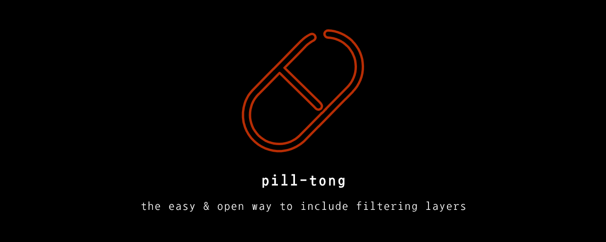

<p align="center">
  
</p>

](https://img.shields.io/github/v/release/maverick-ksj/pill-tong)
](https://img.shields.io/github/v/tag/maverick-ksj/pill-tong)
](https://img.shields.io/github/license/maverick-ksj/pill-tong)
[](https://snyk.io/test/github/maverick-ksj/pill-tong)

[English](./README.md) | Korean

**Pill-Tong** 은 NodeJS로 작성되었으며, 사용자가 원하는 방식으로 HTTP 요청을 *필터링* 할 수 있도록 고안된 [Reverse Proxy](https://en.wikipedia.org/wiki/Reverse_proxy) 서버입니다.

사용 방법은 간단합니다. (1) [pill-tong](https://www.npmjs.com/package/pill-tong) NPM 모듈을 설치하고 (2) 사용할 Middleware 필터를 설정한 다음 (3) `pilltong` 명령을 입력해 실행하기만 하면 됩니다.

현재 제공되는 필터는 다음과 같습니다 :

* [xss](https://github.com/maverick-ksj/pill-tong-xss-filter)
* [sqli](https://github.com/maverick-ksj/pill-tong-sqli-filter)

이를 통해 HTTP 요청에 대해 필터링을 적용할 수 있게 됩니다.

## 시작하기

### 1\. npm을 통해 pill-tong 모듈 설치

```sh
npm install pill-tong -g
```

### 2\. pill-tong 서비스 생성

```sh
pilltong --create
```

### 3\. [pill-tong 설정 파일](#pill-tong-설정-파일) 구성

```sh
# 설정 파일은 기본적으로 pill-tong.yml 로 생성됩니다
vim pill-tong.yml
```

### 4\. **방화벽 설정**

* 사용자의 실제 서버 포트: `private`
* pill-tong 프록시 서버 포트: `public`

### 5\. pill-tong 프록시 서버 시작

```sh
pilltong
```

## 옵션

```sh
--create # 서비스 생성
--conf <path> # 설정 파일 위치 지정 (default: ./pill-tong.yml)
--noHello # 시작 메시지 출력 여부 (default: false)
```

## Pill-Tong 설정 파일

```yml
# 사용자 서버 설정
client:
  host: 'localhost' # 사용자 서버 주소
  port: 3000 # 사용자 서버 포트 (private port)

# pill-tong 프록시 서버 설정
proxy:
  port: 80 # 프록시 서버 포트 (public port)

# 필터 목록
filters:
  - 'xss-filter' # npm을 통해 설치된 필터
  - './filter/my-filter' # 사용자 정의 필터

# ssl 설정 (비활성화)
ssl: false

# ssl 설정 (활성화)
# ssl:
#     key: './cert/private.pem'
#     cert: './cert/public.pem'
```

## 라이센스

Pill-Tong은 [MIT License](./LICENSE)를 따릅니다.
